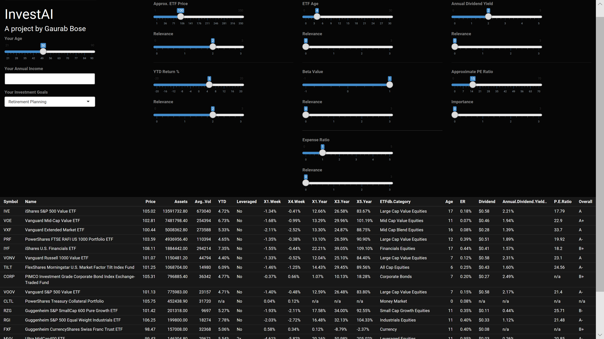

 # InvestAI (Working build, but still in development)

author: Gaurab Bose

This is a currently in-progress project that aims provide investors a tool to indentify the best ETFs (Exchange Traded Funds) to invest in, based on a variety of their investment preferences. It works more than just a mere filtering tool across a database of securities, because it weights relative importance of various investment criterion to the investor, and specifically prevents the presented data suggestions from being too narrow/broad, by adaptively adjusting the output to include the best set of suggestions, given the user's inputs. The tool using k-Means clustering and k-Nearest Neighbours classifications.

### Instructions

Please note that this project is still in development and I haven't had to time to work on improving the accuracy of the results. It can be still be run in R-Studio if you are curious to see how the tool works so far.

The GUI is powered by R-Shiny, which is scripted in the ui.R and server.R files. The data preprocessing and training script is in the code.R file.

- ui.R - Includes code needed to define the UI components, naturally.
- server.R - Includes code needed to run the backend of the program, i.e. making the knobs and dials actually do something worthwhile.
- code.R - Contains the purely the script that is imported into the server.R environment in order to parse user inputs and provide data for output.

### Screenshot

